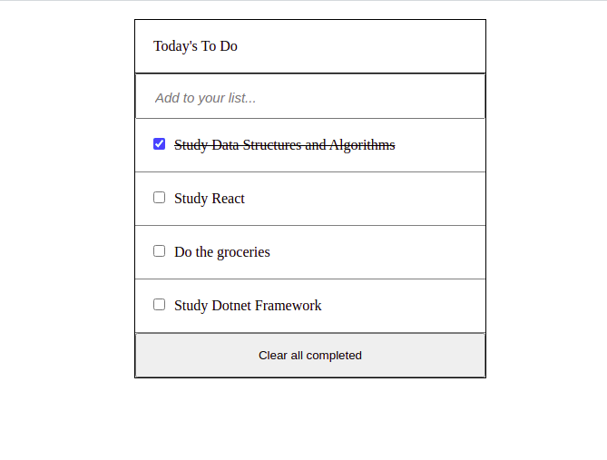

# Todo List - Jose Abel Ramirez Frontany

ToDo's Tasks App where you can add a todo, edit the todo by clicking on it, change the completed property of the todo object from false to true by checking the checkbox and a line-through CSS property will be display on the description of the todo, and finally can delete one particular todo by clicking the delete trashcan icon when in edit mode and also delete all completed todo's by clicking the 'clear all completed' button at the bottom. All changes are saved on the localhost browser storage.



## Built With

- HTML
- CSS
- JavaScript

## Getting Started

To get a local copy up and running follow these simple example steps.

### Setup

Go to the top of the page, press te green button that says "Code", and copy the link. Then you have to go to your console and type

```
    git clone 'repository-link'
```

That's all, you are ready to go!

### Install

Run the following command to have all npm packages dependencies installed:

```
    npm install
```

### Usage

To start the webpack-dev-server, run the following command:

```
    npm run start
```

### Live Demo Server

- [live-version](https://jose-abel-todo-app.netlify.app/)

### Tests

Javascript linters

```
    npx eslint .
```

HTML linters

```
    npx hint .

```

CSS linters

```
    npx stylelint "**/*.{css,scss}"
```

## Author: Jose Abel Ramirez Frontany\*\*

- GitHub: [Jose Abel Ramirez Frontany](https://github.com/jose-Abel)
- Linkedin: [Jose Abel Ramirez Frontany](https://www.linkedin.com/in/jose-abel-ramirez-frontany-7674a842/)

## 🤝 Contributing

Contributions, issues, and feature requests are welcome!

## 📝 License

This project is MIT licensed.

## Show your support

Give a ⭐️ if you like this project!
